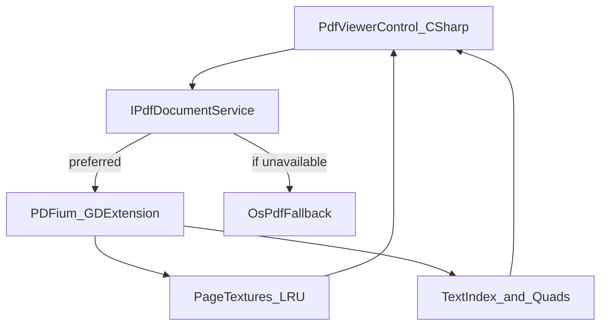

# PDF Viewing Strategy for ChemClassify

## Context

ChemClassify is **Godot 4.7 + C#**, already export-aware for Android (`net9.0` in [ChemClassify.csproj](ChemClassify.csproj)). Target platforms: **desktop + Android + iOS**. Required PDF capabilities:

- **Must:** view, pan, zoom, page navigation
- **Must:** search, text selection, copy
- **Out of scope for now:** forms, annotations, full PDF editing UI
- **UX preference:** stay inside Godot UI; OS fallback allowed if needed

There is **no existing PDF code** in the repo yet.

---

## Options researched

### 1. CEF / gdCEF / godot-cef + PDF.js

Embed Chromium, host Mozilla **PDF.js** inside it.

| Pros | Cons |
|------|------|
| Best ready-made PDF UX (zoom, search, select, copy) | **Desktop only** — CEF does not support Android/iOS |
| Same Chromium engine on Win/Mac/Linux | Large binary (~100MB–1GB artifacts) |
| Rich JS ecosystem later | Heavy for a chemistry/classify app |

**Verdict:** Excellent desktop prototype, **not viable as the primary mobile strategy**.

### 2. Native WebView (godot_wry) + PDF.js

Use OS webview (WebView2 / WKWebView / WebKitGTK) + PDF.js.

| Pros | Cons |
|------|------|
| Smaller than CEF; PDF.js still gives A+B | **Android/iOS support in godot_wry is planned, not shipped** |
| Good desktop path | Webview often draws **on top** of Godot (not a true in-scene texture) |
| | Engine differences per OS |

**Verdict:** Attractive long-term if mobile lands; **not ready** for your targets today.

### 3. Rasterize PDF → Godot textures (ImageMagick / Ghostscript / Poppler CLI)

Convert each page to PNG/JPEG, show with `TextureRect` + pinch zoom.

**ImageMagick specifically:** it can rasterize PDFs, but almost always **delegates to Ghostscript**. It produces **bitmaps only** — no text layer, no search index, no selection quads. To get search/copy you would re-OCR or keep a parallel text pipeline, which is fragile and expensive.

| Pros | Cons |
|------|------|
| Conceptually simple | **Fails requirement B** without extra text pipeline |
| Works everywhere if you ship converters | High-zoom = huge textures / memory |
| Useful for thumbnails / previews | Slow; licensing (Ghostscript) complexity |

**Verdict:** Fine for **thumbnails or offline preview caches**, **not** the main viewer for A+B.

### 4. Native PDF engine in-process (PDFium / MuPDF) → textures + text API

Load PDF via a **GDExtension** (or custom C++/Rust plugin), render pages to `Image`/`ImageTexture`, drive UI in Godot. Use the engine’s **text extraction + character bounding boxes** for search, selection, and clipboard copy.

Existing Godot-adjacent work: [pdfium-gde](https://github.com/aliarcanakgun/pdfium-gde) (Godot 4.5+, render + text rects; young project — treat as reference, not a guaranteed drop-in for all mobile ABIs).

| Pros | Cons |
|------|------|
| **Same architecture on desktop + mobile** if you ship per-platform binaries | You build zoom/pan/selection UI yourself |
| True in-Godot viewport (textures) | Selection/copy is more work than PDF.js |
| Search + hit-testing is supported by PDFium | Must maintain native builds (win/mac/linux/android/ios) |
| Scalable: lazy pages, DPI based on zoom, LRU texture cache | Immature Godot wrappers may need forking |

**Verdict:** **Best primary fit** for ChemClassify’s platform + A+B constraints.

### 5. Platform-native viewers (fallback)

- Android: `PdfRenderer` overlay or `Intent` / `ACTION_VIEW`
- iOS: `PDFKit` / `QLPreviewController`
- Desktop: shell-open default PDF app

| Pros | Cons |
|------|------|
| Minimal effort; reliable | Leaves Godot UI / inconsistent UX |
| Free search/select on some platforms | Harder to integrate with app chrome |

**Verdict:** Keep as **explicit fallback** behind the same service interface.

---

## Recommended architecture (committed)

**Primary path: PDFium-backed document service + Godot Control viewer.**  
**Fallback path: open with OS PDF handler when native plugin unavailable or render fails.**

### Why this over CEF/PDF.js as primary

You need **Android + iOS inside Godot**. CEF cannot do that. ImageMagick cannot do selection/search honestly. PDFium is the same engine Chrome uses under the hood, ships on mobile widely, and exposes text geometry needed for B.

PDF.js remains a **future optional desktop enhancer** (via WebView/CEF) if you later want a richer viewer without rewriting mobile.

### Viewer capabilities mapping

| Need | Implementation |
|------|----------------|
| View pages | `render_page(page, scale)` → `ImageTexture` |
| Pan / scroll | Godot `ScrollContainer` / custom gesture layer |
| Zoom | Change render scale (not just stretch pixels); debounce + progressive low-DPI then high-DPI |
| Search | Build per-page text + optional global index from PDFium text API; highlight match rects |
| Select / copy | Hit-test character/word quads; draw selection overlay; `DisplayServer.clipboard_set` |
| Memory scale | Lazy load visible ±N pages; LRU evict textures; cancel stale high-DPI jobs |

### App integration shape (fits current C# systems style)

Mirror existing UI systems (e.g. [Systems/LoginSystem/LoginUISystem.cs](Systems/LoginSystem/LoginUISystem.cs)):

- `IPdfDocumentService` — open/close, page count, render, search, get text quads
- `PdfViewerSystem` / Control scene under `SystemsUI/` — binds UI to service
- `OsPdfFallback` — `OS.shell_open` / platform plugins when GDExtension missing

Keep PDF bytes on disk or memory stream; do not convert whole docs to ImageMagick images as the source of truth.

### Platform delivery

1. Desktop first (Windows) with PDFium GDExtension + viewer MVP (view/pan/zoom).
2. Add search + selection overlays.
3. Add Android/iOS PDFium binaries to the same `.gdextension` config.
4. Wire OS fallback for export templates where the extension is absent.

### What not to do

- Do **not** make CEF+PDF.js the only path (blocks mobile).
- Do **not** use ImageMagick as the viewing pipeline for A+B.
- Do **not** stretch a low-res page texture for zoom indefinitely — re-render at higher DPI when zoom settles.

---

## Suggested evaluation spike (before full feature build)

A short spike validates the approach without committing the whole product UI:

1. Load a sample multi-page PDF via PDFium (or fork/wrap pdfium-gde).
2. Show one page in a Control with pinch/scroll zoom and re-render-on-settle.
3. Run a text search and draw highlight rects.
4. Select a word and copy to clipboard.
5. Confirm Android arm64 binary links in a test export (iOS can follow).

If the spike fails on mobile binaries, activate OS fallback for that platform while keeping the same `IPdfDocumentService` API.

---

## Decision summary

| Option | Role in ChemClassify |
|--------|----------------------|
| PDFium + Godot UI | **Primary** viewer for desktop + mobile |
| OS native open | **Fallback** only |
| CEF/WebView + PDF.js | Optional later desktop upgrade, not primary |
| ImageMagick / pure raster | Thumbnails / offline previews only, not main viewer |
