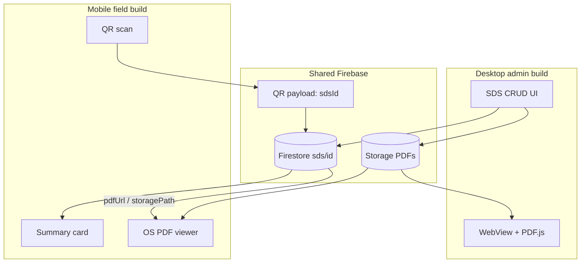

Here’s a structured plan in the same style as `PDFIntegrationPlan.md`, with the reduced desktop/mobile split.

---

# PDF Integration Strategy for ChemClassify (Revised)

**overview:** Split PDF handling by platform. Desktop (admin) uses an in-app WebView + PDF.js for preview during SDS CRUD. Mobile (field) resolves a QR → Firestore id → Storage URL and opens the OS PDF viewer (stream/cache via the system; no in-app PDF engine and no user-driven “download PDF” workflow). Shared backbone is Firestore metadata + Firebase Storage for PDF bytes.

**keywords:**

CRUD: create, read, update, delete

SDS: security data sheet

**todos:**


| id              | content                                                                            | status  |
| --------------- | ---------------------------------------------------------------------------------- | ------- |
| data-model      | Define Firestore `sds/{id}` schema + Storage path convention + QR payload          | pending |
| storage-rules   | Auth-gated Storage/Firestore rules (admin write, authenticated read)               | pending |
| desktop-crud    | Admin upload/replace/delete PDF + write/update Firestore metadata                  | pending |
| desktop-webview | Spike godot_wry (or equivalent) + PDF.js preview on Windows desktop                | pending |
| mobile-lookup   | QR scan → Firestore get by id → summary card                                       | pending |
| mobile-os-open  | Resolve Storage URL → `OS.shell_open` / platform intent to OS PDF viewer           | pending |
| url-strategy    | Prefer short-lived signed/download URLs; document fallback download tokens for MVP | pending |


**isProject:** false  

---

## Context

ChemClassify is **Godot 4.7 + C#**, export-aware for Android. Product direction:


| Surface     | Role                                                      | PDF need                                                            |
| ----------- | --------------------------------------------------------- | ------------------------------------------------------------------- |
| **Desktop** | Administrative tools — full SDS PDF CRUD against Firebase | In-app preview so admins stay inside ChemClassify                   |
| **Mobile**  | Field use — scan QR, get chemical/SDS info                | Open SDS in the **OS PDF viewer** from a URL; no custom PDF library |


There is **no existing PDF code** in the repo. Firebase auth/connect scaffolding exists; Storage/Firestore SDS paths are not implemented yet.

### Product constraints (revised)

- **Must (desktop):** upload/replace/delete PDF; list/lookup by id; in-app view/pan/zoom (search/select/copy nice-to-have via PDF.js).
- **Must (mobile):** QR → query by id; show a **small** summary UI; open full SDS via OS viewer without requiring the user to manually download/save a file.
- **Out of scope:** PDFium/MuPDF in Godot; rebuilding full SDS content as hundreds of Godot widgets; forms/annotations/PDF editing; offline-first PDF cache as MVP; CEF on mobile.
- **UX preference:** desktop stays in-app; mobile may leave the Godot chrome for the system PDF app (acceptable for prototype).

---

## Scope split (committed)




| Concern       | Desktop                      | Mobile                                      |
| ------------- | ---------------------------- | ------------------------------------------- |
| PDF rendering | Godot WebView + PDF.js       | OS native viewer                            |
| PDF bytes     | Read/write Firebase Storage  | Read-only URL → OS (stream/cache by system) |
| Query         | Admin list/search + by id    | QR → Firestore `get(sdsId)` only            |
| Widgets       | Admin forms + preview pane   | Thin summary + CTA “View SDS”               |
| Binary weight | WebView OK on admin machines | No PDF engine in APK                        |


---

## Tools and decisions

### 1. Desktop admin — Godot WebView + PDF.js

**Choice:** Native OS webview plugin (e.g. **godot_wry** / WebView2 on Windows) hosting **Mozilla PDF.js**.


| Pros                                               | Cons                                                     |
| -------------------------------------------------- | -------------------------------------------------------- |
| Best ready-made zoom/search/select/copy for admins | Desktop-oriented; do not rely on mobile webview support  |
| Stays “inside” the app chrome more than shell-open | WebView may composite on top of Godot (known limitation) |
| No PDFium ABI maintenance                          | Plugin maturity / export packaging to verify in spike    |


**Verdict:** **Primary desktop PDF preview.** Optional later: “Open in system viewer” as fallback if WebView fails.

**Not primary:** CEF (heavier than needed for MVP); PDFium (more UI work for same admin outcome).

### 2. Mobile field — OS PDF display

**Choice:** After Firestore lookup, open an **HTTPS PDF URL** with `OS.shell_open` (spike first). If unreliable on target devices, thin Android `ACTION_VIEW` / iOS open-URL plugin.


| Pros                                                         | Cons                             |
| ------------------------------------------------------------ | -------------------------------- |
| Zero in-app PDF engine; correct SDS layout                   | Leaves Godot UI briefly          |
| System handles stream/cache — user isn’t asked to “download” | Needs network; offline SDS later |
| Fast path to a functional prototype                          | Viewer UX differs by device      |


**“Cached without download” meaning (explicit):**

- App does **not** implement “Save PDF to Downloads / Files” as the primary flow.
- App does **not** ship or require a Godot PDF reader.
- OS/browser may **stream and transiently cache** the file for display — that is allowed and expected.
- App may hold only the **id + metadata + URL string** in memory (and optional short URL cache), not a user-facing PDF file library.

**Verdict:** **Primary mobile SDS viewing path.**

### 3. Data — Firestore by id + Storage for PDF bytes

**Choice:**

- **Firestore:** document per SDS, keyed by stable `sdsId` (also what the QR encodes).
- **Firebase Storage:** binary PDF files under a fixed path convention (see below).
- **QR:** encodes **only the id** (or a short app deep-link containing the id), never the PDF bytes or a long Storage URL.

**Verdict:** Shared source of truth. Desktop writes; mobile reads.

### 4. Explicitly deferred / rejected for this phase


| Option                                         | Role now                                             |
| ---------------------------------------------- | ---------------------------------------------------- |
| PDFium / MuPDF GDExtension                     | **Not used**                                         |
| ImageMagick / Ghostscript raster pipeline      | **Not used** (optional later: admin thumbnails only) |
| Full SDS as Godot widgets                      | **Not used** — thin summary card only on mobile      |
| CEF + PDF.js on mobile                         | **Not used**                                         |
| Single `IPdfDocumentService` for all platforms | **Split** into desktop preview vs mobile open-URL    |


---

## Where PDFs and metadata live

### QR payload

Recommended MVP:

```text
ChemClassify SDS id only, e.g. raw string:  "sds_8f3a2c1b"
```

Optional later: `chemclassify://sds/sds_8f3a2c1b` for deep links.

**Do not** put Firebase download URLs in the QR (they rotate, leak access, and break when files are replaced).

### Firestore — `sds/{sdsId}`

Minimal fields for prototype:


| Field           | Type      | Purpose                                  |
| --------------- | --------- | ---------------------------------------- |
| `sdsId`         | string    | Same as doc id; echo for clients         |
| `displayName`   | string    | Chemical / product name for summary card |
| `casNumber`     | string?   | Optional summary                         |
| `hazardSummary` | string?   | One short line for mobile card           |
| `storagePath`   | string    | Path in Storage bucket (canonical)       |
| `fileName`      | string    | Original upload name                     |
| `contentType`   | string    | `application/pdf`                        |
| `updatedAt`     | timestamp | Admin/audit                              |
| `createdAt`     | timestamp | Admin/audit                              |
| `createdBy`     | string?   | Admin uid                                |
| `active`        | bool      | Soft-delete / hide from field            |


Optional later: GHS codes, location, batch, version number, checksum.

Mobile summary uses a **handful** of these fields only; the PDF remains the full SDS.

### Firebase Storage — PDF bytes

Canonical path convention:

```text
gs://<bucket>/sds/{sdsId}/current.pdf
```

Optional versioning later:

```text
gs://<bucket>/sds/{sdsId}/versions/{timestamp}.pdf
```


| Rule                             | Detail                                                                                               |
| -------------------------------- | ---------------------------------------------------------------------------------------------------- |
| One “current” object per `sdsId` | Admin replace overwrites `current.pdf` (or upload new version + update pointer)                      |
| Firestore `storagePath`          | Always points at the object to open (e.g. `sds/{sdsId}/current.pdf`)                                 |
| Naming                           | Prefer stable `current.pdf` over original filename in Storage; keep original in Firestore `fileName` |


### URL resolution (mobile + desktop preview fetch)

1. Client authenticates (existing Firebase auth path).
2. Client reads `sds/{sdsId}` from Firestore.
3. Client obtains a **download/signed URL** for `storagePath` (Firebase Storage download URL or short-lived signed URL from a Cloud Function).
4. **Desktop:** feed URL or fetched bytes into WebView/PDF.js.
5. **Mobile:** `OS.shell_open(url)` → OS PDF viewer streams/displays.

MVP can use Firebase download URLs with Storage rules requiring auth. Prefer signed URLs with expiry before production hardening.

---

## Recommended architecture

### Shared service surface (C#)

Keep platform adapters thin; share id → metadata → URL:

```text
ISdsRepository
  - GetAsync(sdsId) → SdsRecord
  - ListAsync(...)          // desktop
  - UpsertMetadataAsync(...) // desktop
  - DeleteAsync(...)         // desktop (soft or hard)

ISdsPdfStorage
  - UploadAsync(sdsId, stream/path)
  - GetOpenUrlAsync(sdsId) → Uri   // signed/download URL
  - DeleteAsync(sdsId)

IDesktopPdfPreview   // desktop only
  - Show(url or local/temp bytes) in WebView + PDF.js

IMobilePdfOpen       // mobile only
  - OpenInOsViewer(url)
```

Mirror existing systems style (`Systems/`, `SystemsUI/`, `FirebaseSystems/`).

### Desktop admin flow

1. Authenticate as admin.
2. Create/edit SDS record → choose PDF file.
3. Upload to `sds/{sdsId}/current.pdf`.
4. Write/update Firestore doc.
5. Preview pane: WebView loads PDF.js with that file/URL.
6. Generate/print QR encoding `sdsId` (print pipeline can be later).

### Mobile field flow

1. Authenticate (field user).
2. Scan QR → parse `sdsId`.
3. `GetAsync(sdsId)` → summary card (name, CAS, short hazard, updated date).
4. User taps **View safety data sheet**.
5. `GetOpenUrlAsync` → `OpenInOsViewer`.
6. OS displays PDF (stream/cache). User returns to app via back/switcher.

No in-Godot page textures, search overlays, or PDF.js on mobile for this phase.

---

## Viewer / capability mapping


| Need                                | Desktop              | Mobile                      |
| ----------------------------------- | -------------------- | --------------------------- |
| View SDS pages                      | WebView + PDF.js     | OS PDF viewer               |
| Pan / zoom / search in PDF          | PDF.js               | OS app                      |
| Upload / replace / delete PDF       | Admin CRUD + Storage | N/A                         |
| Resolve chemical after QR           | Optional admin test  | Firestore by id             |
| Show key fields without full SDS UI | Admin form fields    | Summary card only           |
| Avoid user “download PDF” step      | N/A (admin uploads)  | Open URL in OS viewer       |
| Stay in Godot chrome                | Preferred (WebView)  | Not required for PDF itself |


---

## Platform delivery plan

### Phase A — Data spine (both platforms blocked on this)

1. Create Firestore collection `sds` and Storage prefix `sds/`.
2. Document path + field schema (as above).
3. Security rules: authenticated read; admin-only write (custom claim or allowlist for MVP).
4. Implement `GetAsync` + `GetOpenUrlAsync` in C#.

### Phase B — Desktop admin MVP

1. Spike WebView plugin on Windows + load a local/sample PDF via PDF.js.
2. Wire upload → Storage `current.pdf` → Firestore upsert.
3. List/detail UI + preview pane.
4. Fallback button: OS open URL if preview fails.
5. QR generation for `sdsId` (can be a simple display/export).

### Phase C — Mobile field MVP

1. QR scan → parse id → Firestore get → summary scene.
2. “View SDS” → resolve URL → `OS.shell_open` (Android first).
3. Error states: invalid QR, missing doc, missing file, network/auth failure.
4. If `shell_open` is flaky, add minimal Android intent plugin; then iOS.

### Phase D — Hardening (after prototype works)

1. Short-lived signed URLs.
2. Soft-delete / `active` flag.
3. Replace-PDF versioning.
4. Role claims for admin vs field.
5. Optional: cache last-opened metadata only (still not a PDF library UX).

---

## Suggested evaluation spikes

**Desktop spike (before full admin UI):**

1. Embed WebView on Windows.
2. Load PDF.js with one sample SDS.
3. Confirm zoom/scroll usable inside admin layout.
4. Confirm Godot UI still usable around/under the webview.

**Mobile spike (before full field UI):**

1. Hardcode a Storage download/signed URL to a sample PDF.
2. Call `OS.shell_open` from an Android export.
3. Confirm system viewer opens without a manual save dialog as the primary path.
4. Then replace hardcoded URL with Firestore id → `storagePath` → URL.

**Shared spike:**

1. One Firestore doc + one Storage object.
2. Desktop upload writes both; mobile read opens the same object.

If mobile OS-open fails on a device class, keep the same `GetOpenUrlAsync` API and only swap the open implementation — do not fall back to building an in-app PDF engine for MVP.

---

## What not to do (this phase)

- Do **not** make PDFium the primary path for desktop or mobile.
- Do **not** rebuild full SDS sections as Godot controls.
- Do **not** put PDF URLs or file bytes in QR codes.
- Do **not** require users to download PDFs into a local library to read SDS content.
- Do **not** block the prototype on perfect signed-URL security or offline sync.
- Do **not** wait for godot_wry mobile support — mobile does not use WebView for PDF.

---

## Decision summary


| Piece                                 | Role in ChemClassify                     |
| ------------------------------------- | ---------------------------------------- |
| **Firestore `sds/{sdsId}`**           | Index + summary fields; QR target        |
| **Storage `sds/{sdsId}/current.pdf`** | Canonical PDF bytes                      |
| **Desktop WebView + PDF.js**          | In-app admin preview during CRUD         |
| **Mobile OS PDF viewer via URL**      | Field SDS viewing (system stream/cache)  |
| **Thin mobile summary card**          | Context before opening OS viewer         |
| **PDFium / full in-Godot PDF UI**     | Out of scope                             |
| **OS open on desktop**                | Fallback only                            |
| **ImageMagick raster**                | Out of scope (optional thumbnails later) |


---

## Bottom line

Develop **one Firebase SDS model** and **two thin clients**:

1. **Admin desktop** — CRUD + WebView preview.
2. **Field mobile** — QR → Firestore by id → summary → OS viewer URL.

That is the reduced, well-defined scope: no universal PDF library, no widget-for-every-SDS-section, and no user-mandated PDF download workflow on mobile.